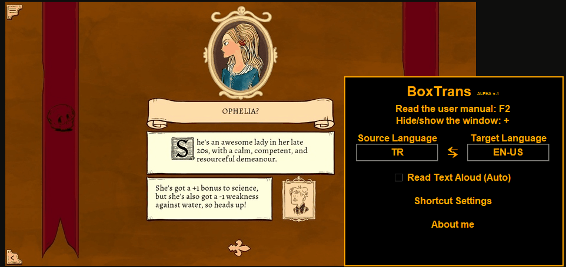

# 🏆 BoxTrans: Yapay Zeka Destekli Gerçek Zamanlı Ekran Çevirmeni

  
  
  
  

  <b>Eğer BoxTrans'ı beğendiyseniz, projeyi desteklemek için lütfen GitHub üzerinden bir ⭐ verin!</b>

- Güçlü, yapay zeka tabanlı gerçek zamanlı ekran çeviri ve OCR aracı. **GPU Hızlandırma** desteğiyle ekranınızdaki herhangi bir metni anında yakalayın, çevirin ve sesli olarak dinleyin.

---

## 📺 Önizleme

  

## 🚀 Öne Çıkan Özellikler

| Özellik | Açıklama |
| :--- | :--- |
| **🏎️ Turbo GPU Modu** | **YENİ!** NVIDIA CUDA desteği ile **6 kat daha hızlı** OCR işlemi (~0.2sn). |
| **⚡ Yüksek Hızlı OCR** | Milisaniye düzeyinde metin tanıma için **PaddleOCR** (PP-OCRv4) ile güçlendirilmiştir. |
| **🧠 DeepL Yapay Zeka** | Dünyanın en iyi çeviri motoru DeepL ile doğal ve bağlama uygun çeviriler. |
| **🔊 Yapay Zeka Sesi (gTTS)** | Anında ve yüksek kaliteli sesli okuma için **entegre FFmpeg paketi**. |
| **🛡️ Akıllı Yedekleme** | Donanımı otomatik algılar; uyumlu GPU yoksa sorunsuzca CPU moduna geçer. |
| **🖥️ HUD Arayüzü** | Oyunlarınızın üzerinde duran, şeffaf ve rahatsız etmeyen modern panel. |
| **🎮 Oyuncu Dostu** | Hikaye odaklı oyunlarda Pencere ve Çerçevesiz modlarla tam uyumlu çalışır. |

---

## 🛠️ Gereksinimler & Kurulum

1. **Yönetici Yetkisi:** Ekran yakalama ve kısayol tuşlarının çalışması için `boxtrans.exe` dosyasını daima **Yönetici Olarak Çalıştırın**.
2. **GPU Desteği (Opsiyonel):** Turbo mod için NVIDIA GPU (Maxwell mimarisi veya daha yenisi) gereklidir.
3. **DeepL API Anahtarı:** [DeepL Geliştirici Portalı](https://www.deepl.com/pro-api) üzerinden ücretsiz anahtarınızı alın.
4. **Harici Bağımlılık Yok:** Sürüm 1.4+; yerleşik **cuDNN**, **FFmpeg** ve **CUDA kütüphanelerini** içerir—ayrı bir kurulum gerekmez!

> [!IMPORTANT]
> **Antivirüs Notu:** Yüksek performanslı Nuitka derlemesi ve ekran okuma davranışı nedeniyle bazı güvenlik yazılımları uyarı verebilir. BoxTrans %100 güvenlidir; gerekirse uygulama klasörünü beyaz listeye ekleyin.

---

## 💻 Teknik Altyapı
- **Motor:** Nuitka ile derlenmiş yüksek performanslı ikili dosya.
- **OCR:** PaddleOCR Framework (GPU/CPU Çift Motor).
- **Ses:** Gömülü FFmpeg, FFplay, FFprobe paketi.
- **Çeviri:** DeepL API Entegrasyonu.
- **Arayüz:** CustomTkinter Modern UI.

---

## 📦 Kurulum
1. [Releases](https://github.com/BoxTranslate/boxtrans/releases) sayfasından en güncel `boxtrans_setup.exe` dosyasını indirin.
2. Uygulamayı kurun (tüm gerekli kütüphaneler 1GB'lık pakete dahildir).
3. Çalıştırın ve en hızlı çeviri deneyiminin tadını çıkarın!

---

## 🛡️ Dosya Bütünlüğü (Checksum)
İndirdiğiniz dosyanın güvenliğini doğrulamak için SHA256 özet değerini kontrol edebilirsiniz:  
`sha256:c0a0876fa0d56a32e5ddcddcdca243922a670fcebdbd8393b4773da0774c392a`

---

## 📜 Lisans & Gizlilik
Bu proje **Ücretsiz Yazılım (Freeware)** olarak sunulmaktadır.  
- **Kullanım:** Kişisel ve ticari olmayan kullanım için ücretsizdir.
- **Koruma:** Tüm fikri mülkiyet hakları **BoxTranslate**'e aittir. 
- **Gizlilik:** BoxTrans, OCR işlemini yerel olarak yapar. Sadece seçtiğiniz metinler, çeviri için güvenli SSL üzerinden DeepL'e gönderilir.

---

## 📧 İletişim & Destek
**Thewalkry** tarafından Python ile geliştirilmiştir.  

- **Github Sayfası:** [boxtranslate.github.io](https://boxtranslate.github.io/boxtrans/)
- **E-posta:** herrmanndolunay@gmail.com
- **Reddit:** [u/Thewalkry](https://www.reddit.com/user/Thewalkry/)
- **DonanımHaber:** [Forum'a gitmek için tıklayın](https://forum.donanimhaber.com/yerli-proje-oyunlarda-telefonla-ceviri-yapmaya-son-boxtrans-ekran-ustu-anlik-ceviri-araci--162742706)

  

---

© 2024-2025 BoxTrans Projesi. Tüm hakları saklıdır.

